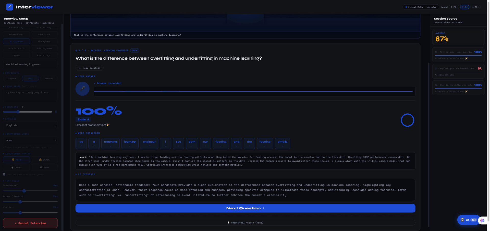

# 🎤 Interviewer — AI Mock Interview App

A fully local AI-powered mock interview app that runs entirely on your computer.  
No cloud APIs. No subscriptions. Your data stays on your machine.


---



## ✨ Features

- **AI Interviewer** — LLM generates role-specific questions at junior / mid / senior difficulty
- **Voice Questions** — Kokoro TTS reads questions aloud with 16 neural voices (American & British)
- **SVG Avatars** — 4 animated interviewer avatars with real-time lip sync driven by audio
- **Speech Recognition** — faster-whisper transcribes your spoken answers locally
- **Pronunciation Scoring** — word-level scoring with correct / wrong / missing / extra breakdown
- **AI Feedback** — Ollama streams personalized feedback on each answer
- **Model Answers** — on-demand hint generation showing ideal answers
- **Session Summary** — overall feedback and average score at interview end
- **Database Builder** — manage a personal Q&A knowledge base with full CRUD + JSON import
- **10 Role Presets** — Software Eng, ML Engineer, Data Scientist, DevOps, Product Manager, and more
- **Fully Modular** — split backend (`routes/`) and frontend (`static/js/`) architecture

---

## 🛠 Tech Stack

| Component | Technology |
|---|---|
| Speech-to-Text | [faster-whisper](https://github.com/SYSTRAN/faster-whisper) (base model, int8) |
| Language Model | [Llama 3.2:1b](https://ollama.com/library/llama3.2) via [Ollama](https://ollama.com) |
| Text-to-Speech | [Kokoro-82M](https://github.com/hexgrad/kokoro) (16 neural voices) |
| Backend | [FastAPI](https://fastapi.tiangolo.com) + uvicorn |
| Frontend | Vanilla JS + CSS (no framework) |
| Database | JSON flat file (`data/db.json`) |

---

## 📋 Requirements

- macOS (Apple M1 tested)
- Python 3.11+
- [Ollama](https://ollama.com) installed and running
- ~2GB disk space for models

---

## 🚀 Installation

### 1. Clone the repo

```bash
git clone https://github.com/tsejavhaa/interviewer
cd interviewer
```

### 2. Create a virtual environment

```bash
python3 -m venv .venv
source .venv/bin/activate
```

### 3. Install Python dependencies

```bash
pip install fastapi uvicorn[standard] aiofiles
pip install faster-whisper
pip install kokoro soundfile
pip install requests numpy
```

### 4. Pull the LLM model

```bash
# Install Ollama if you haven't already
brew install ollama

# Pull the model (~500MB)
ollama pull llama3.2:1b
```

---

## ▶️ Running the App

Open **two terminals**:

**Terminal 1 — Start Ollama:**
```bash
ollama serve
```

**Terminal 2 — Start the app:**
```bash
cd interviewer
source .venv/bin/activate
export PYTORCH_ENABLE_MPS_FALLBACK=1
uvicorn server:app --host 127.0.0.1 --port 8766
```

Then open your browser at **http://127.0.0.1:8766**

---

## 📁 Project Structure

```
interviewer/
├── server.py                    ← FastAPI app entry point (47 lines)
├── routes/
│   ├── __init__.py
│   ├── health.py                ← GET /health
│   ├── settings.py              ← POST /settings/voice, /speed
│   ├── session.py               ← all /session/* endpoints
│   └── database.py              ← all /db/* endpoints
├── llm_module.py                ← Ollama HTTP client
├── tts_module.py                ← Kokoro-82M TTS (16 voices)
├── stt_module.py                ← faster-whisper STT
├── session_module.py            ← session state machine
├── scorer_module.py             ← pronunciation scoring
├── db_module.py                 ← JSON database CRUD
├── static/
│   ├── app.css                  ← all styles
│   └── js/
│       ├── state.js             ← global variables
│       ├── utils.js             ← shared helpers
│       ├── avatar.js            ← SVG avatars + lip sync
│       ├── health.js            ← health check + voice init
│       ├── setup.js             ← role, difficulty, voice controls
│       ├── session.js           ← start, cancel, restore session
│       ├── interview.js         ← questions, recording, scoring, hints
│       └── database.js          ← DB builder modal
├── data/
│   └── db.json                  ← Q&A knowledge base (auto-created)
├── index.html                   ← HTML structure only
└── sample_questions.json        ← example import format
```

---

## 🎙 How to Use

### Running an Interview

1. **Select a role** from the preset chips or type a custom one
2. **Choose difficulty** — Junior, Mid, or Senior
3. **Optionally add focus areas** (e.g. "React, system design")
4. **Set question count** with the slider (3–10)
5. **Pick a voice** and avatar for your interviewer
6. Click **Begin Interview** — questions generate in ~10 seconds
7. Listen to the question, then press **🎤** to record your answer
8. View pronunciation score, word breakdown, and AI feedback
9. Click **💡 Show Model Answer** to see the ideal response
10. Continue through all questions to see your session summary

### Database Builder

Click the **🗄 DB** button in the bottom-right corner to open the database builder.

- **Add records** — question, answer, role, difficulty, tags
- **Edit / Delete** existing records
- **Search and filter** by keyword or difficulty level
- **Import JSON** — bulk import from a file using this format:

```json
{
  "questions": [
    {
      "Question": "What is gradient descent?",
      "Answer": "Gradient descent is an optimization algorithm...",
      "Difficulty": "mid",
      "Tags": ["optimization", "ml"],
      "Role": "Machine Learning Engineer"
    }
  ]
}
```

---

## 🔧 Configuration

### Environment Variables

| Variable | Default | Description |
|---|---|---|
| `OLLAMA_MODEL` | `llama3.2:1b` | Ollama model to use |
| `OLLAMA_BASE` | `http://localhost:11434` | Ollama server URL |
| `TTS_VOICE` | `am_adam` | Default TTS voice |

Example using a larger model:
```bash
OLLAMA_MODEL=llama3.1:8b uvicorn server:app --host 127.0.0.1 --port 8766
```

### Available Voices

| Code | Name | Accent |
|---|---|---|
| `am_adam` | Adam | American Male |
| `am_michael` | Michael | American Male |
| `am_echo` | Echo | American Male |
| `am_eric` | Eric | American Male |
| `am_liam` | Liam | American Male |
| `af_heart` | Heart | American Female |
| `af_sarah` | Sarah | American Female |
| `af_bella` | Bella | American Female |
| `af_nicole` | Nicole | American Female |
| `bf_emma` | Emma | British Female |
| `bf_isabella` | Isabella | British Female |
| `bm_george` | George | British Male |
| `bm_lewis` | Lewis | British Male |
| `bm_daniel` | Daniel | British Male |

---

## 🐛 Troubleshooting

**"Preparing…" hangs for more than 30 seconds**
```bash
# Test Ollama directly — should respond in under 15 seconds
curl -s http://localhost:11434/api/generate \
  -d '{"model":"llama3.2:1b","prompt":"List 3 questions","stream":false,"options":{"num_predict":80}}' \
  | python3 -c "import sys,json; print(json.load(sys.stdin).get('response','')[:100])"

# If slow, warm up the model first
ollama run llama3.2:1b
# Press Ctrl+D to exit — model stays loaded in memory
```

**No audio playback**
- Make sure your browser allows autoplay — click anywhere on the page first
- Check Kokoro is installed: `python3 -c "import kokoro; print('OK')"`

**Static files not updating (304 Not Modified)**
- Hard reload: `Cmd + Shift + R`

**Microphone not working**
- Browser requires HTTPS or localhost — use `http://127.0.0.1:8766` not `http://0.0.0.0:8766`

**`ModuleNotFoundError: aiofiles`**
```bash
pip install aiofiles
```

**`ModuleNotFoundError: kokoro`**
```bash
pip install kokoro soundfile
```

---

## 📡 API Reference

| Method | Endpoint | Description |
|---|---|---|
| `GET` | `/health` | Server status, active session, voices |
| `POST` | `/settings/voice` | Change TTS voice |
| `POST` | `/settings/speed` | Change TTS speed |
| `POST` | `/session/create` | Start a new interview session |
| `GET` | `/session/question/{n}/audio` | Get TTS audio for question N |
| `POST` | `/session/answer/{n}` | Submit audio answer for question N |
| `GET` | `/session/feedback/{n}` | Stream AI feedback (SSE) |
| `GET` | `/session/hint/{n}` | Stream model answer hint (SSE) |
| `GET` | `/session/summary` | Get overall session summary |
| `DELETE` | `/session` | Clear current session |
| `GET` | `/db/records` | List all DB records (filterable) |
| `POST` | `/db/records` | Create a record |
| `PUT` | `/db/records/{id}` | Update a record |
| `DELETE` | `/db/records/{id}` | Delete a record |
| `GET` | `/db/stats` | Record counts by role and difficulty |
| `POST` | `/db/import-json` | Bulk import from JSON file |

---

## 📄 License

MIT License — free to use, modify, and distribute.